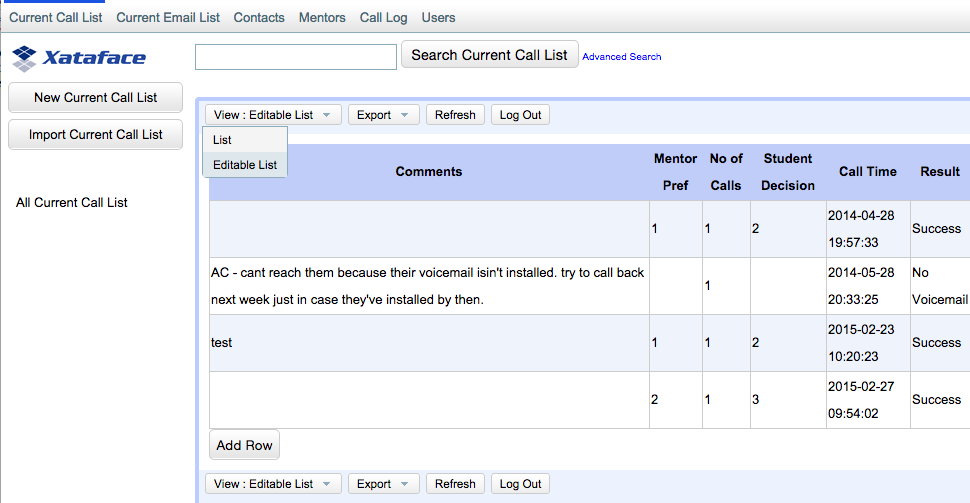
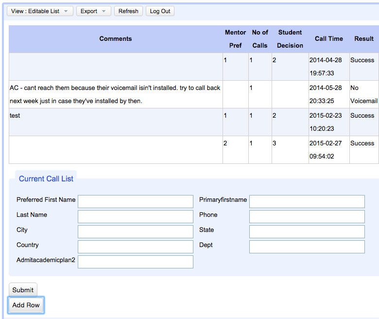
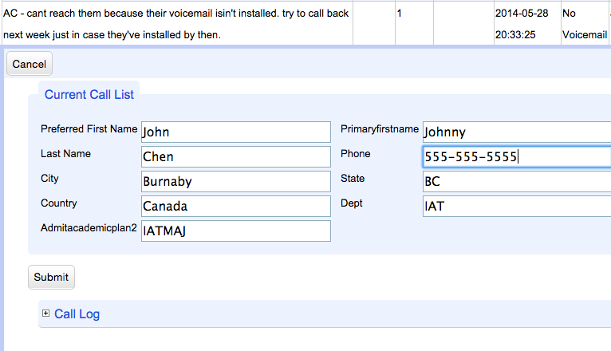
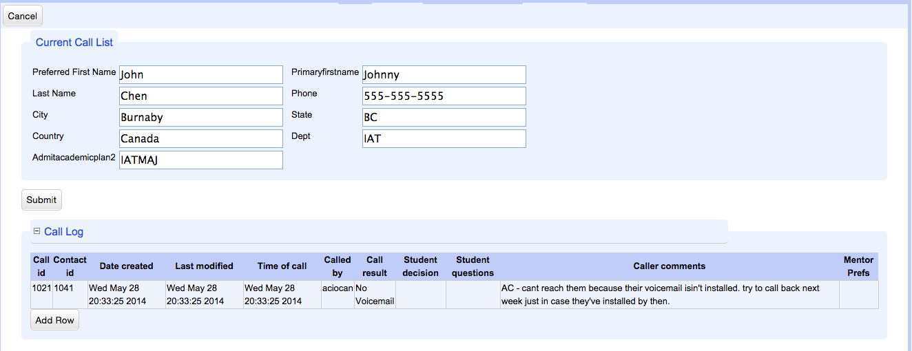
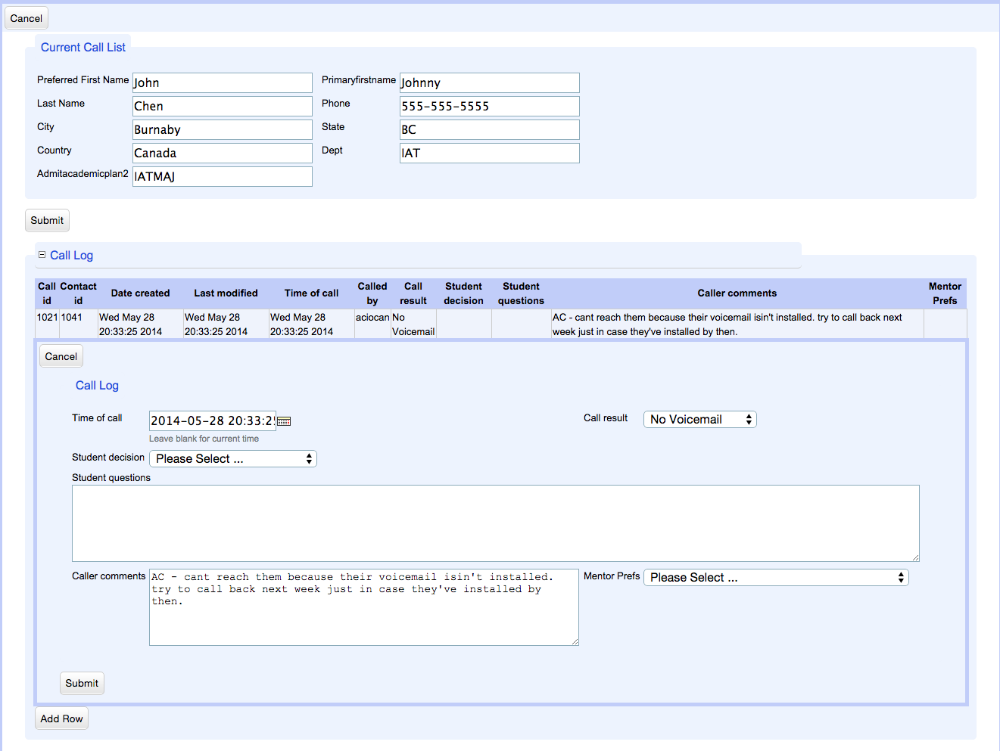

= Xataface Ajax Form Module

This module adds "AJAX Form" functionality to Xataface.  This could be used to add more sophisticated inline editing ability in many different contexts, but currently it only provides an "Editable List" action.

== License

Apache License 2.0

== Installation

=== Lightning Instructions

Assuming your Xataface application is at /var/www/myapp

With Git:
----
$ cd /var/www/myapp
$ mkdir modules
$ cd modules
$ git clone https://github.com/shannah/xataface-module-ajax_form.git ajax_form
----

Or with ZIP:

1. Download the module as a https://github.com/shannah/xataface-module-ajax_form/archive/master.zip[ZIP Archive]
2. Extract the `xataface-module-ajax_form-master.zip` file and rename the resulting directory `ajax_form`.
3. Copy or move the `ajax_form` directory inside your application's `modules` directory.  I.e. `/var/www/myapp/modules/ajax_form`.

=== Configuration

Adding the `ajax_form` directory to your app's `modules` folder won't actually activate the module in your app.  You additionally need to add the following to the `_modules` section of your `conf.ini` file:

----
modules_ajax_form=modules/ajax_form/ajax_form.php
----

== Usage

Once the module is installed in your app, you will notice that there is an "Editable" list action available.  You can see this by clicking the "View: List" button in the upper right of the list view (if you are using the G2 theme)

If you select this option, you'll see the current result set with a slightly different formatting:

Notice, that "Add Row" button at the bottom of the list.  If you press, this it will expand to show you a form to add a row to the list.  This form is different than the standard Xataface Edit form in that it doesn't direct you to a new page.  It is embedded in the current page using AJAX.

Similarly, if you click on any of the rows in the list, it will expand to show an edit form just below the row.

If the row being edited has relationships, they will be included in the form as expandable sections.  Expanding these sections will show the related records in a table.

And, just as with the top-level list, you can click to edit any of the rows in the relationship, or even add new rows.

You can continue to navigate down the tree of relationships indefinitely in this manner.

